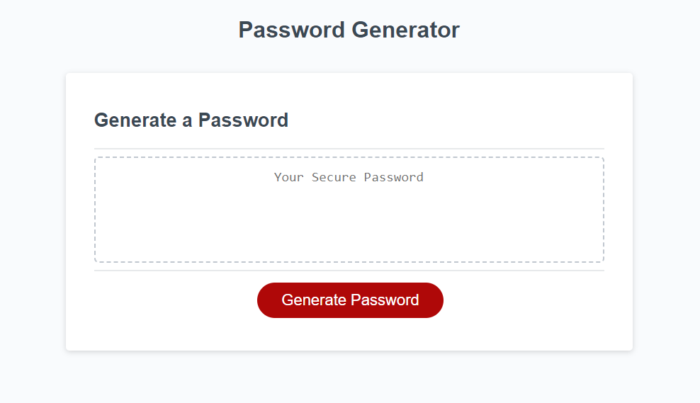
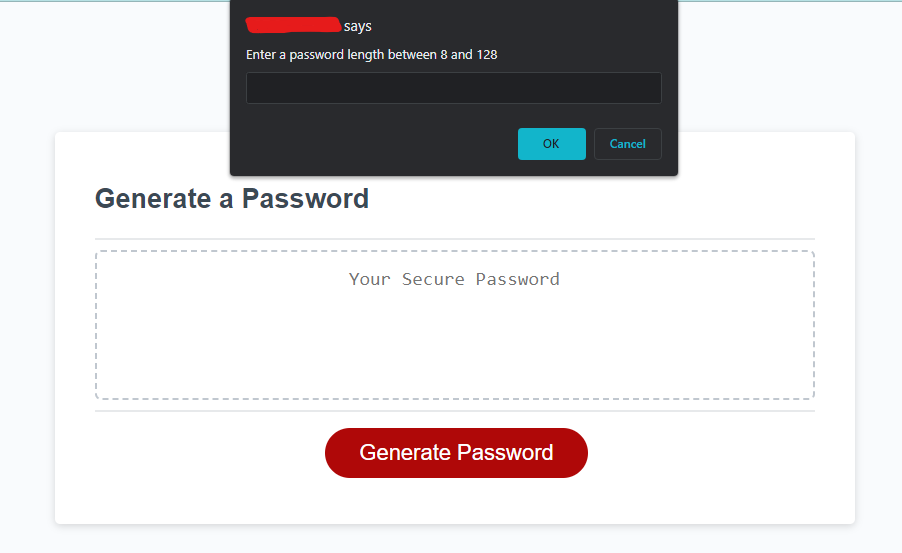
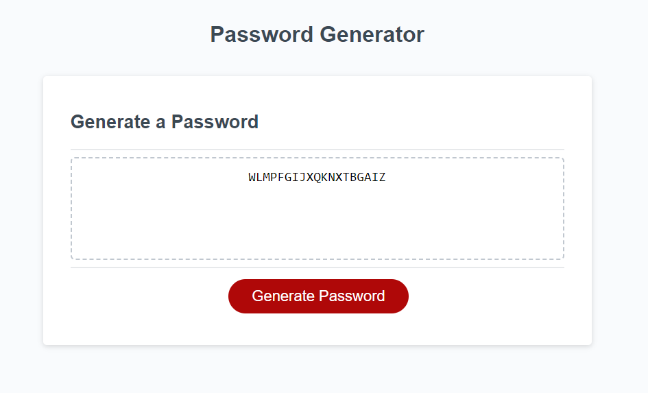

# <Password Generator>

## Description

Provide a short description explaining the what, why, and how of your project. Use the following questions as a guide:

- I made this password generator to generate a secure password whenever needed.
- I built it to improve my understanding of javascript.
- It helps with anyone that needs a random password generated, perhaps of a specific length in a certain character type.
- I learnt more about javascript and the forloop as well as more in depth on variables.

## Installation

N/A

## Usage

Upon visiting the Password Generator site, you should be greeted with a interface and a button that says generate password.

After which, to generate your password, click on the button labeled "Generate Password", upon doing so you will be promted with the following question. "How many characters? 8-120"

After inputting a number between 8 and 128 , you will be prompted again for what kind of character type you'd like your password to be, you may choose between "special, numeric, lowercase,uppercase".

After the previous steps, you will then see your password inputted in the box with the length and type you requested!

## Credits

For this project I found a source on stack overflow that greatly helped me with the layout and the idea of how to do it all. Although I had to clean it up in the end and fix it to my needs as well.
https://stackoverflow.com/questions/62627469/random-password-generator-with-prompts

## License

Refer to the license in the repository.
---
